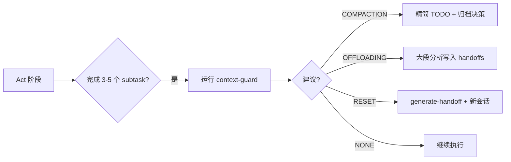

# 上下文管理工具链（Context Management Toolchain）

> 本文档是 `context-management-strategy.md` 的工程化落地指南，定义了可视化、自动化、工具链三层增强体系。
> 
> **对应策略文档**: `docs/superpowers/context-management-strategy.md`  
> **状态追踪文件**: `.project/context-session.json`

---

## 1. 设计目标

将上下文管理从"人工阅读文档后手动执行"升级为"状态可观测、触发可自动化、执行有工具"的工程化流程。

| 维度 | 当前痛点 | 目标状态 |
|------|---------|---------|
| **可视化** | 只能靠 AI 自觉或人眼判断上下文是否过载 | 任何时刻都能用一条命令看到上下文健康度 |
| **自动化** | 触发条件（60min/25files）依赖人工计时计数 | 脚本自动检测并给出策略建议，AI 只需确认执行 |
| **工具链** | handoff/decision 全靠 AI 现场发挥格式 | 标准化模板 + 生成脚本，确保结构统一、路径正确 |

---

## 2. 可视化层（Visibility Layer）

### 2.1 会话健康度仪表盘

通过 `scripts/context-guard.sh` 输出当前会话的关键指标：

```text
╔══════════════════════════════════════════╗
║       Context Health Dashboard           ║
╠══════════════════════════════════════════╣
║  Elapsed Time        : 42 min            ║
║  Modified Files      : 18                ║
║  Handoff Docs        : 2                 ║
║  Decision Archives   : 3                 ║
║  Active TODOs        : 7                 ║
╠══════════════════════════════════════════╣
║  Strategy Suggestion : COMPACTION        ║
║  Reason              : >30min & >10files ║
╚══════════════════════════════════════════╝
```

### 2.2 状态文件可视化

`.project/context-session.json` 是会话的唯一可信状态源，任何工具（AI、脚本、CI）均可读取：

```json
{
  "session_id": "sess-20260603-001",
  "task_id": "T-123",
  "started_at": "2026-06-03T09:00:00+08:00",
  "strategy_checks": [
    {
      "timestamp": "2026-06-03T09:30:00+08:00",
      "elapsed_min": 30,
      "modified_files": 12,
      "suggestion": "COMPACTION",
      "acted_upon": false
    }
  ]
}
```

### 2.3 资产索引页

在 `docs/superpowers/handoffs/INDEX.md` 和 `docs/superpowers/decisions/INDEX.md` 中维护快速索引，避免 AI 在大量文件中迷失：

```markdown
# Handoff 索引

| 文件 | 任务 | 状态 | 时间 |
|------|------|------|------|
| [generator-evaluator-...](generator-evaluator-research-2026-05-28.md) | 运行时验证调研 | completed | 2026-05-28 |
```

---

## 3. 自动化层（Automation Layer）

### 3.1 触发检测自动化

`scripts/context-guard.sh` 在以下时机被调用：

| 时机 | 调用方 | 动作 |
|------|--------|------|
| AI 完成 3-5 个 subtask 后 | AI Engine | 运行 guard，根据建议执行 compaction |
| AI 读取/修改文件后 | AI Engine | 运行 guard，若文件数 >20 提前预警 |
| 用户手动检查 | Driver | `bash scripts/context-guard.sh` |
| 提交前 | lefthook（可选） | 若修改文件 >25 个，拦截并提示执行 Reset |

### 3.2 文档生成自动化

| 场景 | 脚本 | 产物 |
|------|------|------|
| 需要 Reset | `scripts/generate-handoff.sh` | `docs/superpowers/handoffs/<task-id>-<ts>.md` |
| 中间决策产生 | `scripts/archive-decision.sh` | `docs/superpowers/decisions/<date>-<title>.md` |
| Compaction 后 | AI 调用 guard 更新 `acted_upon` | `.project/context-session.json` 记录 |

### 3.3 与生命周期整合



---

## 4. 工具链层（Toolchain Layer）

### 4.1 脚本清单

| 脚本 | 平台 | 功能 | 用法示例 |
|------|------|------|---------|
| `context-guard` | bash + ps1 | 检测上下文健康度，输出策略建议 | `bash scripts/context-guard.sh` |
| `generate-handoff` | bash + ps1 | 生成标准化 handoff 文件 | `bash scripts/generate-handoff.sh T-123 in_progress` |
| `archive-decision` | bash + ps1 | 归档中间决策到 decisions/ | `bash scripts/archive-decision.sh "使用 Vite" "..." "..." "..."` |

### 4.2 状态文件规范

`.project/context-session.json` 字段规范：

| 字段 | 类型 | 必填 | 说明 |
|------|------|------|------|
| `session_id` | string | 是 | 全局唯一会话标识 |
| `task_id` | string | 是 | 关联的任务/议题 ID |
| `started_at` | ISO8601 | 是 | 会话开始时间 |
| `last_checked_at` | ISO8601 | 否 | 上次 guard 检查时间 |
| `strategy_checks` | array | 否 | 历次检查记录 |
| `strategy_checks[].timestamp` | ISO8601 | 是 | 检查时间 |
| `strategy_checks[].elapsed_min` | number | 是 | 已耗时（分钟） |
| `strategy_checks[].modified_files` | number | 是 | 已修改文件数 |
| `strategy_checks[].suggestion` | enum | 是 | NONE / COMPACTION / OFFLOADING / RESET |
| `strategy_checks[].acted_upon` | boolean | 是 | 是否已执行该建议 |

### 4.3 与现有脚本的协同

```text
scripts/
├── context-guard.sh          <-- 新增：上下文健康检查
├── generate-handoff.sh       <-- 新增：生成 handoff
├── archive-decision.sh       <-- 新增：归档决策
├── check-ops-changelog.sh    <-- 现有：审计日志检查
├── check-docs-structure.sh   <-- 现有：文档结构检查
└── ...
```

`context-guard` 与 `check-ops-changelog` 的关系：  
- `context-guard` 关注**会话级**状态（时间、文件数、上下文压力）  
- `check-ops-changelog` 关注**提交级**合规（审计日志是否更新）  
- 在 Reset 后生成 handoff 时，应同时更新 `ops_changelog.md` 记录上下文管理事件

---

## 5. 使用流程（AI / Driver 双模式）

### 模式 A：AI 自主执行（推荐）

```markdown
1. Act 阶段每完成 3-5 个 subtask，AI 运行 `bash scripts/context-guard.sh`
2. 若建议 COMPACTION：
   - 精简 Todo List（已完成项折叠为一句话）
   - 将关键决策归档：`bash scripts/archive-decision.sh "..." "..." "..." "..."`
   - 更新 `.project/context-session.json` 的 `acted_upon: true`
3. 若建议 RESET：
   - 运行 `bash scripts/generate-handoff.sh <task-id> in_progress`
   - 新会话启动时读取 handoff 文件并确认接续
```

### 模式 B：Driver 手动介入

```bash
# 随时检查当前会话健康度
bash scripts/context-guard.sh

# 手动生成交接文档
bash scripts/generate-handoff.sh T-123 in_progress

# 手动归档一个刚刚做出的决策
bash scripts/archive-decision.sh \
  "使用 Zod 替代 Yup" \
  "所有表单校验统一使用 Zod" \
  "Zod 与 TypeScript 集成更好，Yup 类型推导弱" \
  "影响 src/validation/ 目录，后续任务需同步迁移"
```

---

## 6. Red Flags（工具链版）

| 禁止项 | 检测方式 |
|--------|---------|
| 上下文明显腐烂时继续堆砌 | `context-guard` 建议 RESET 但未执行 |
| Handoff 文件丢失关键决策 | `generate-handoff` 模板强制包含"关键决策"章节 |
| Compaction 时删除待办项 | AI 自检 + 模板约束 |
| 同一任务 Reset 超过 3 次 | `context-session.json` 统计 Reset 次数并警告 |
| 新会话不阅读 handoff | SessionStart 话术强制要求确认 handoff |

---

## 7. 实施路线图

### Phase 1：MVP（当前已实现）

- [x] `scripts/context-guard.sh` / `.ps1` — 健康度检查
- [x] `scripts/generate-handoff.sh` / `.ps1` — Handoff 生成
- [x] `scripts/archive-decision.sh` / `.ps1` — 决策归档
- [x] `.project/context-session.json` — 状态追踪模板
- [x] `docs/superpowers/decisions/` — 决策目录初始化

### Phase 2：工具增强（已完成）

- [x] `scripts/surgical-check.sh` / `.ps1` — 工作流选择辅助判断
- [x] `scripts/generate-indexes.sh` / `.ps1` — 资产索引自动生成

### Phase 3：（按需补充）

- [ ] 根据实际使用反馈，补充其他通用脚本
- [ ] 上下文压力预测：基于历史数据优化 guard 阈值
