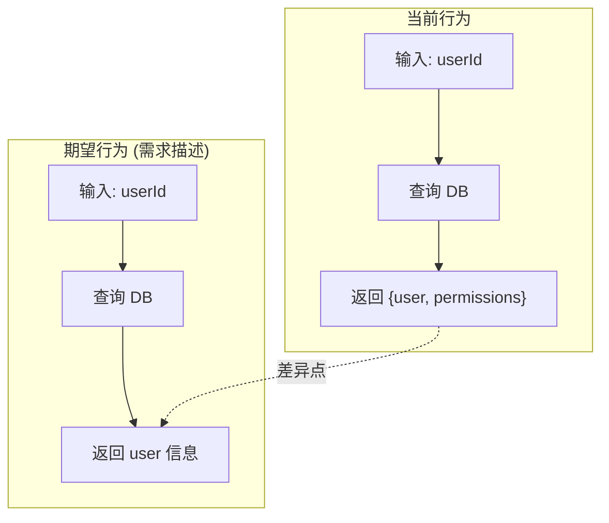
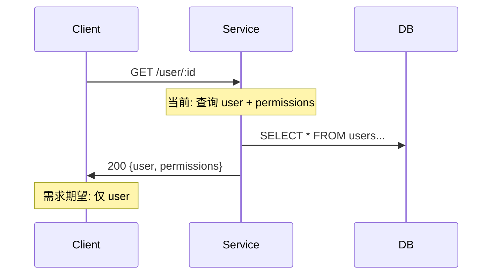

# 手术切入式开发工作流 (Surgical Workflow)

## 1. 定位与上下文

本工作流是**标准生命周期的精简分支**，用于处理已有功能的轻量级变更。

标准生命周期（`docs/superpowers/lifecycle.md`）适用于全新功能开发和重大架构变更，
要求完整的 Spec → Issue → Plan → TDD → 三层验证 → Distill 闭环。

当变更范围小（≤10 文件）、目标明确、无架构变更、且为现有模块内部调整时，使用本工作流以减少文档负担和流程摩擦。

---

## 2. 快速判断（触发器）

AI 在接收任务后，**立即执行**以下判断：

```markdown
- [ ] 修改文件数 ≤ 10 个？
- [ ] 用户能描述"修改 X 使其在 Y 场景下输出 Z"？
- [ ] 不涉及接口/数据模型/依赖关系变更？
- [ ] 修改对象是已存在的功能（非全新模块）？
```

> 💡 **辅助工具**：可运行 `bash scripts/surgical-check.sh "<任务描述>"` 获取量化参考，但仅作辅助，最终决策需结合上述四项人工判断。

**结果：**

| 勾选数 | 结论 |
|--------|------|
| 4/4 ✅ | **使用 Surgical Workflow** — 执行轻量级 brainstorming → 逻辑 MRI |
| < 4 | **回退标准生命周期** — 执行完整 brainstorming → Spec → Issue → Plan |

**重要**：不满足条件时强行使用 Surgical Workflow 会导致方向偏差和返工。

---

## 3. 适用条件（详细说明）

| 条件 | 说明 |
|------|------|
| **范围有限** | 修改文件数 ≤ 10 个，且不含新增目录结构 |
| **目标明确** | 用户能描述"修改 X 使其在 Y 场景下输出 Z" |
| **无架构变更** | 不涉及接口契约变更、数据模型变更、依赖关系变更 |
| **已有代码基** | 修改对象必须是已存在的功能，而非全新模块 |

**不满足任一条件 → 切换回标准生命周期。**

---

## 4. 工作流阶段

```text
轻量级澄清 ──→ 逻辑 MRI ──→ 安全垫 ──→ 极简计划 ──→ 增量开发 ──→ 验证与闭环
 (Brainstorm)   (理解+映射)    (锁定)      (规划)       (实施)       (确认)
```

---

### 阶段 0：轻量级澄清 (Lightweight Brainstorming)

**定位：** superpowers `brainstorming` 技能的**裁剪执行**。不替代 upstream 技能，而是在其框架内压缩范围。

superpowers 哲学要求**每个项目都必须经过设计确认**。Surgical Workflow 的裁剪在于：将 design doc 压缩到最小可行内容，而非跳过输出。

**动作（在 `brainstorming` 技能框架内执行）：**

1. **快速上下文扫描**（≤2 分钟）：
   - 阅读与任务直接相关的代码文件
   - 检查最近的 git 提交（`git log --oneline -5 -- <相关路径>`）
   - 查看 `docs/superpowers/handoffs/` 下是否有相关遗留上下文

2. **提出 1–3 个澄清问题**（one at a time，multiple choice 优先）：
   - 聚焦边界条件、预期输出格式、错误处理方式、与现有行为的兼容性

   *示例：*
   > "当输入数组为空时，期望返回 `[]` 还是抛出异常？  
   > A. 返回 `[]`  
   > B. 抛出 `ValidationError`  
   > C. 保持当前行为（当前返回 `null`）"

3. **最小设计确认 + 输出 design doc**：
   - 用 2–3 句话概括：改动位置、改动方式、预期结果
   - 等待用户确认（"ok" / 👍 / 明确回复即视为通过）
   - **输出极简 design doc** 到 `docs/superpowers/specs/YYYY-MM-DD-<topic>-design.md`

**极简 design doc 模板：**

```markdown
# <Topic> Design

## Goal
<一句话目标>

## Approach
<2-3 句话描述改动方式>

## References
- 参考接口: `src/xxx.ts::functionName()`
- 参考设计: `src/yyy.ts` 中的类似实现

## Boundaries
<已确认的边界条件>
```

**与标准 brainstorming 的区别：**

| 维度 | 标准 brainstorming (`lifecycle.md`) | Lightweight Brainstorming (本工作流) |
|------|--------------------------------------|--------------------------------------|
| 输出 | 完整 design doc（多 section） | 极简 design doc（上述模板，≤10 行） |
| 问题数量 | 按需，可能 5–10 个 | 硬性限制 ≤3 个 |
| 方案对比 | 必须提出 2–3 个 approaches | 仅需 1 个推荐方案 |
| 暂停点 | 用户逐 section 确认 | 一次性确认 |
| 评审 | `spec-document-reviewer` subagent | 跳过（范围太小） |

**切换规则：** 如果在澄清过程中发现需求存在重大歧义、涉及架构决策、或用户无法回答关键问题 → **立即停止 Lightweight Brainstorming，切换至标准生命周期**，执行完整 brainstorming。

---

### 阶段 1：逻辑 MRI (Logic MRI & Mapping)

**目标：** 在不通读全量代码的情况下，精准锁定逻辑位置与影响范围，并**暴露需求与现有代码的潜在歧义**。

**动作：**

1. AI 接收用户提供的模糊入口点（函数名、关键字、类名、错误日志片段）。
2. 执行全量扫描：`grep` 定位定义 + 查找所有引用点。
3. 向上追溯调用链（谁调用了这个函数），向下追踪副作用（这个函数修改了什么状态）。
4. **需求-代码对齐检查**（仅当修改已有功能时执行）：
   - 阅读关键代码路径，理解当前实际行为
   - 将"当前行为"与"用户需求中的期望行为"进行逐项对比
   - 识别隐含假设、边界差异、输出格式不一致

**输出（必须写入临时文件）：**

````markdown
## 逻辑简报
- **触发条件**：当 X 发生时
- **执行流程**：系统执行 Y，然后 Z
- **副作用**：写入数据库表 A，调用外部 API B
- **影响范围**：文件 M、N、P（共 3 个）

## 需求-代码对齐检查

| 检查项 | 结果 | 说明 |
|--------|------|------|
| 需求是否指定了边界条件？ | ✅/❌/⚠️ | ... |
| 现有代码行为是否与需求字面描述一致？ | ✅/❌/⚠️ | ... |
| 是否存在隐含假设？ | ✅/❌/⚠️ | ... |
| 返回值/输出格式是否有差异？ | ✅/❌/⚠️ | ... |

## 当前行为 vs 期望行为（Mermaid）

当发现需求与代码行为不一致时，使用 Mermaid 图呈现差异。

### 示例：流程差异



### 示例：序列图差异



> ⚠️ **歧义暴露**：需求说"返回用户信息"，当前实现返回 `{user, permissions}`。
> 改动方案：A. 仅返回 `user`（Breaking Change）；B. 保持现状，更新需求描述。
> 请确认。

## 影响地图

| 层级 | 组件 | 关系 |
|------|------|------|
| 直接修改 | `src/auth.ts` | 目标文件 |
| 直接调用 | `src/api/login.ts` | 调用方 |
| 间接影响 | `tests/e2e/login.spec.ts` | 测试覆盖 |

````

**歧义暴露规则：**

- 如果发现需求与代码行为不一致，**必须在继续 coding 前向用户确认**
- 使用 Mermaid 图呈现差异（推荐 `flowchart` 或 `sequenceDiagram`，视场景选择）
- 提供明确的选项（A/B/C 或 Yes/No）供用户选择
- 用户确认后，将确认结果追加到 MRI 输出文件
- 如果歧义涉及架构决策 → **立即切换至标准生命周期**，补完整 Spec/Plan

**上下文管理检查：** 如果扫描涉及 >10 个文件，立即执行 **Offloading**
（将 MRI 输出写入 `docs/superpowers/analysis/<task-id>-mri.md`，会话中只保留链接）。

---

### 阶段 2：建立安全垫 (Safety Net)

**目标：** 锁定现状，防止修补 A 时意外破坏 B。

**动作：**

1. 判断现有测试覆盖度：
   - 如果已有单元测试覆盖修改点 → 运行现有测试，记录基线结果。
   - 如果没有测试覆盖 → 编写**特征测试 (Characterization Tests)**。

**特征测试编写规范：**

```typescript
// 原则：不关注"正确性"，只记录"当前实际输出"
describe('Characterization: auth module', () => {
  it('records current behavior for login with valid credentials', () => {
    const result = login('test@example.com', 'password123');
    // 使用快照或硬编码记录当前输出
    expect(result).toEqual({
      token: 'eyJhbGciOiJIUzI1NiIs...', // 当前实际输出
      expiresIn: 3600
    });
  });
});
```

**注意：** 特征测试在 Surgical Workflow 中允许**不清理**——它们只在本次任务中作为安全垫，任务完成后由用户决定是否保留。

---

### 阶段 3：Surgical Plan（极简计划）

**目标：** 在 `writing-plans` 技能框架内，生成仅关注改动差异的极简计划。

**动作：**

1. 激活 `writing-plans` 技能，基于 MRI 输出和阶段 0 的 design doc 生成计划。
2. 输出到 `docs/superpowers/plans/YYYY-MM-DD-<feature-name>-plan/_index.md`
3. **裁剪规则：** 因为范围极小，计划只包含：
   - `_index.md`：Goal + Architecture（1-2 句话）+ tasks YAML（1-3 个 task）
   - 每个 task 一个文件，但内容极简（当前逻辑 → 目标逻辑 → 验证命令）

**极简 `_index.md` 示例：**

```markdown
# <Feature> Surgical Plan

> **For AI:** REQUIRED SUB-SKILL: Load `superpowers:executing-plans` skill.

**Goal:** <一句话>
**Architecture:** <1-2 句话>

## Execution Plan

```yaml
tasks:
  - id: "001"
    subject: "Fix null handling in auth validator"
    slug: "fix-auth-null-handling"
    type: "impl"
    depends-on: []
  - id: "002"
    subject: "Add characterization test for empty input"
    slug: "add-empty-input-test"
    type: "test"
    depends-on: ["001"]
```

**Task File References:**

- Task 001: `001-fix-auth-null-handling.md`
- Task 002: `002-add-empty-input-test.md`

**极简 task 文件示例：**

````markdown
# Task 001: Fix null handling in auth validator

## Context
`src/auth.ts:45-52` — `validateToken()` 当前未处理 `null` 输入。

## Current Logic
```typescript
function validateToken(token: string) {
  return token.startsWith("Bearer "); // 当 token 为 null 时抛异常
}
```

## Target Logic

```typescript
function validateToken(token: string | null) {
  if (!token) return false;
  return token.startsWith("Bearer ");
}
```

## Verification

```bash
npm test -- auth.test.ts
```

````

**约束：**

- tasks YAML ≤ 3 个 task
- 每个 task 文件聚焦单一改动点
- 必须包含**精确的文件路径和行号范围**
- 必须包含**验证命令**

---

### 阶段 4：增量开发与验证

**目标：** 在 `executing-plans` 技能框架内，实施改动并验证。

**动作：**

1. 激活 `executing-plans` 技能，按 Surgical Plan 的 task 文件逐步执行。
2. 每完成一个 task → 运行对应的验证命令。
3. 所有 task 完成后 → 运行完整测试套件（特征测试 + 新 TDD 测试）。

**验证层级（适配三层验证架构）：**

| 层级 | 检查项 | 执行者 |
|------|--------|--------|
| **Layer 1** | lefthook 通过（markdownlint、docs-structure、conventional-commit） | 自动化 |
| **Layer 2** | 特征测试无退化 + 新 TDD 测试通过 + 构建命令 exit 0 | Generator 自身 |
| **Layer 3** | **可选**。如果改动涉及用户可见行为（UI/API 响应），触发 `meta-runtime-evaluator` | 独立 Evaluator |

**合规检查（精简版）：**

Surgical Workflow 不要求完整的 `meta-compliance-checker` checklist，
但必须勾选以下**阻断项 (BLOCKING)**：

```markdown
- [ ] 用户输入校验（如果修改涉及输入处理）
- [ ] 无敏感信息硬编码（检查修改的代码中无 password/secret/token/key）
- [ ] 特征测试或现有测试通过
```

---

### 阶段 5：闭环

**目标：** 完成最小化闭环，记录关键决策。

**动作：**

1. **Git 提交**：使用 Conventional Commits（`fix:` 或 `refactor:`）。
2. **审计日志**：在 `.project/ops_changelog.md` 追加记录（遵循写保护协议）。
3. **决策留档**（如适用）：如果本次改动识别出了可复用模式或重要陷阱，
   按 `context-management-strategy.md` 的中间决策留档机制追加到当前任务 handoff。
4. **清理**：删除临时 MRI 文件（除非用户要求保留）。

**裁剪内容（与标准生命周期相比）：**

- ⚠️ design doc 为极简版本（阶段 0 已输出，但内容 ≤10 行）
- ❌ 不创建 Issue（除非 Bug 需要跟踪）
- ⚠️ Plan 为极简版本（阶段 3 已输出，但 tasks ≤3 个）
- ❌ `meta-distiller` 资产提纯（范围太小，无资产可提）

---

## 5. 与标准生命周期的衔接

```text
标准生命周期 (lifecycle.md)
├── Launch: brainstorming → Spec → Issue → Branch
├── Plan & Act: writing-plans → executing-plans → meta-safe-executor
├── Test & Verify: TDD → 三层验证
├── Distill & Close: meta-distiller → PR → Merge
│
└── 【分支】Surgical Workflow（本工作流）
    ├── 轻量级 brainstorming（裁剪版：≤3 问题 + 极简 design doc）
    ├── 逻辑 MRI（含需求-代码对齐检查 + Mermaid 歧义暴露）
    ├── 安全垫（替代 TDD 的基线建立）
    ├── Surgical Plan（writing-plans 的极简执行：≤3 tasks）
    ├── 增量开发（executing-plans 的精简执行）
    └── 最小闭环（跳过 meta-distiller）
```

**切换规则：**

| 场景 | 使用工作流 |
|------|-----------|
| 全新功能 / 架构变更 / >10 文件 | 标准生命周期 |
| Bug 修复 / 逻辑微调 / 无架构变更重构 / ≤10 文件 | Surgical Workflow |
| 执行过程中发现范围膨胀（>10 文件或架构变更） | **立即切换回标准生命周期**，补 Spec/Plan |
| 阶段 0 澄清发现重大歧义或架构决策 | **立即切换回标准生命周期**，执行完整 brainstorming |
| 阶段 1 MRI 发现需求与代码存在架构级不一致 | **立即切换回标准生命周期**，补完整 Spec/ADR |

---

## 6. 上下文管理

Surgical Workflow 虽然短，但仍需上下文管理：

| 时机 | 动作 |
|------|------|
| MRI 阶段涉及 >10 个文件 | Offloading：将 MRI 输出写入文件 |
| 执行时间 >30 分钟 | Compaction：精简 todo，归档已完成分析 |
| 执行时间 >60 分钟 | Reset：生成 handoff，新建会话接续 |
| 用户提出范围变更 | 中间决策留档：记录变更和影响 |

---

## 7. Red Flags

- ❌ 用 Surgical Workflow 做全新功能开发（缺少完整 Spec 导致方向偏差）
- ❌ 跳过阶段 0 的澄清直接 Logic MRI（未确认的假设会在 MRI 中放大）
- ❌ 发现歧义不确认继续 coding（需求-代码不一致会导致错误实现）
- ❌ 跳过特征测试直接修改代码（无安全垫，易引入退化）
- ❌ 改动点 >10 个仍不切换回标准生命周期
- ❌ 未通过 Layer 1（lefthook）就提交
- ❌ 涉及安全相关修改但未勾选 BLOCKING checklist
